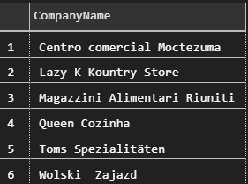
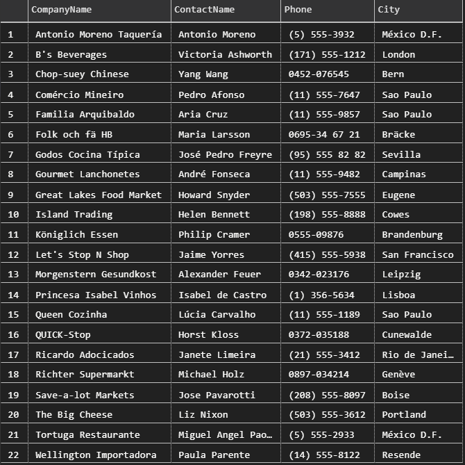
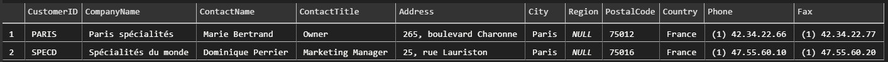
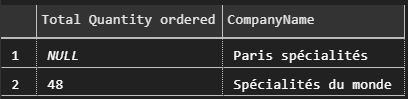
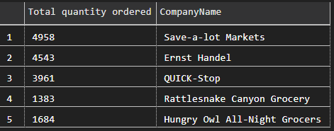
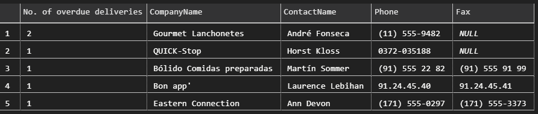

**Notes**:
- This exercise uses the Northwind database
- [Questions](https://github.com/Filipe-p/sql-queries-excercise/blob/master/sql_exercises_homework.md)


----
## 1. How many orders in NWDB?

- ```sql
    SELECT COUNT(OrderID) FROM Orders;
    ```
    ANSWER: 830

## 2. How many orders where the ship city is in Rio?

- ```sql
    SELECT COUNT(OrderID) FROM Orders WHERE ShipCity = 'Rio de Janeiro';
    ```
    ANSWER: 34

## 3. Select all orders where the ship city is Rio or Reims

- ```sql
    SELECT * FROM Orders WHERE ShipCity = 'Rio de Janeiro' or ShipCity = 'Reims';
    ```
    ANSWER: There are 39 such orders (too many to show).

## 4. Select all entries where the company name has a z or Z in Customers

- ```sql
    SELECT CompanyName FROM Customers WHERE CompanyName LIKE '%Z%' OR CompanyName LIKE '%z%';
    -- This works without the OR statement since operators aren't case-sensitive in Azure Data Studios
    ```
    
    

## 5. Find the name, contact name, contact numbers and city of all companies that do not have Fax numbers

- ```sql
    SELECT CompanyName, ContactName, Phone, City FROM Customers WHERE FAX IS NULL;
    SELECT CompanyName, ContactName, Phone, City FROM Suppliers WHERE FAX IS NULL;
    ```

    

    

## 6. Retrieve all customers in Paris

- ```sql
    SELECT * FROM Customers WHERE City = 'Paris';
    ```

    

## 7 a) From the clients in Paris, who orders the most by quantity? 

- ```sql
    SELECT SUM("Order Details".Quantity) AS 'Total Quantity ordered', Customers.CompanyName
    FROM Orders
    RIGHT JOIN "Order Details" ON Orders.OrderID = "Order Details".OrderID
    RIGHT JOIN Customers ON Orders.CustomerID = Customers.CustomerID
    -- I RJ here because I want to see Paris specialites' quantity ordered even if they have no orders
    WHERE Customers.City = 'Paris'
    GROUP BY Customers.CompanyName;
    ```

    


ANSWER: Spécialités du monde has ordered the most by quantity.

## 7 b) Who are our top 5 clients (by quantity)?

- ```sql
    SELECT TOP 5 COUNT("Order Details".Quantity) AS 'Total quantity ordered', Customers.CompanyName
    FROM Orders
    INNER JOIN "Order Details" ON "Order Details".OrderID = Orders.OrderID
    INNER JOIN Customers ON Customers.CustomerID = Orders.CustomerID
    GROUP BY Customers.CompanyName
    ORDER BY COUNT("Order Details".Quantity) DESC;
    ```

    

ANSWER:
1. Save-a-lot Markets
2. Ernst Handel
3. QUICK-Stop
4. Rattlesnake Canyon Grocery
5. Hungry Owl All-Night Grocers

## 8. From the Paris clients, which of their deliveries took longer than 10 days to deliver? 
    Display the company name, contact name, all contact details, and the number of deliveries that took more than 10 days

- ```sql
    SELECT O.OrderID, C.CompanyName, C.ContactName, C.Phone, C.Fax
    FROM Orders O
    INNER JOIN Customers C ON O.CustomerID = C.CustomerID
    WHERE C.City = 'Paris' AND O.ShippedDate - O.RequiredDate > 10;
    ```

ANSWER: There were no late deliveries.

- ```sql
    SELECT COUNT(O.OrderID) AS 'No. of overdue deliveries', C.CompanyName, C.ContactName, C.Phone, C.Fax
    FROM Orders O
    INNER JOIN Customers C ON O.CustomerID = C.CustomerID
    WHERE O.ShippedDate - O.RequiredDate > 10
    GROUP BY C.CompanyName, C.ContactName, C.Phone, C.Fax
    ORDER BY COUNT(O.OrderID) DESC;
    ```
    