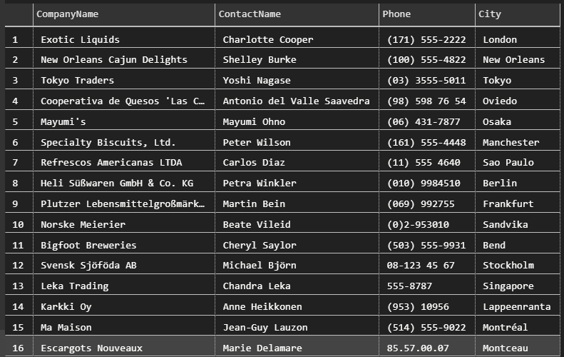

1. How many orders in NWDB?

- ```sql
    SELECT COUNT(OrderID) FROM Orders;
    ```
    830

2. How many orders where the ship city is in Rio?

- ```sql
    SELECT COUNT(OrderID) FROM Orders WHERE ShipCity = 'Rio de Janeiro';
    ```
    34

3. Select all order where the ship city is Rio or Reims

- ```sql
    SELECT * FROM Orders WHERE ShipCity = 'Rio de Janeiro' or ShipCity = 'Reims';
    ```
    There are 39 such orders (too many to show).

4. Select all entries where the company name has a z or Z in Customers

- ```sql
    SELECT CompanyName FROM Customers WHERE CompanyName LIKE '%Z%' OR CompanyName LIKE '%z%';
    ```
    
    

5. Find the name, contact name, contact numbers and city of all companies that do not have Fax numbers

- ```sql
    SELECT CompanyName, ContactName, Phone, City FROM Customers WHERE FAX IS NULL;
    SELECT CompanyName, ContactName, Phone, City FROM Suppliers WHERE FAX IS NULL;
    ```

    
    

6. Retrieve all customers in Paris

- ```sql
    SELECT * FROM Customers WHERE City = 'Paris';
    ```

    

7. From the clients in Paris, who orders the most by quantity? Who are our top 5 clients?

- ```sql
